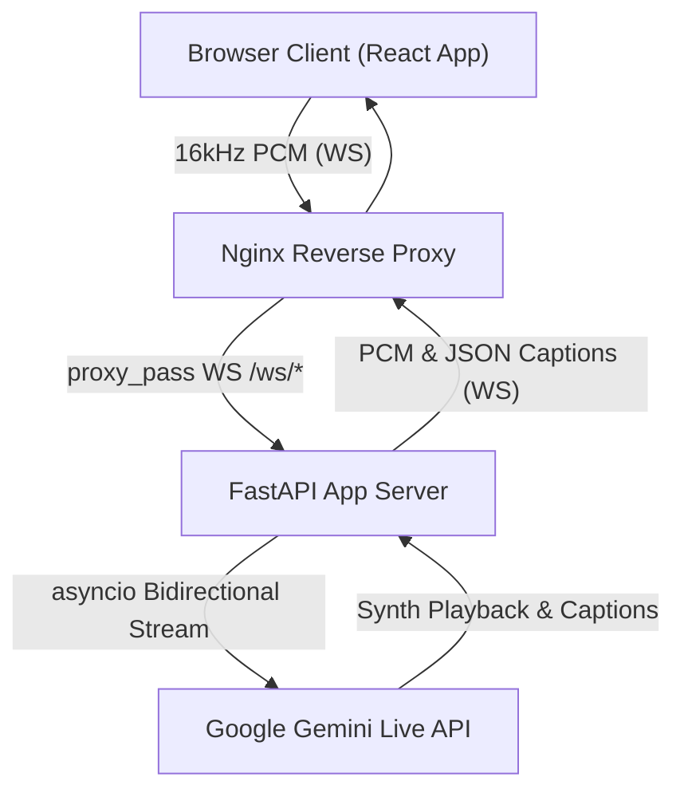

# Real-time Voice Translator: System Architecture & Data Flow

This document details the latency considerations and real-time processing pipelines implemented in the voice translation engine.

---

## 🛰️ High-Level System Architecture

The application is structured into three main architectural tiers:
1.  **Client Tier (React Browser Application)**: Captures analog voice input, downsamples to the required model format, handles visual captions state, and outputs synthesized voice.
2.  **Proxy Tier (Nginx Reverse Proxy)**: Terminates HTTP connections, acts as a load-balancer, secures cross-site calls, and manages real-time WebSocket packet upgrade routes.
3.  **App Server Tier (FastAPI & Gemini Live)**: Runs the persistent async WebSocket connection, routes incoming buffers, and maintains state connection loops with Google Gemini API endpoints.

---

## 🎙️ Low-Latency Audio Streaming Pipeline

To achieve real-time speech translation with low round-trip latency, the audio processing pipeline bypasses disk storage entirely and operates in-memory:

1.  **Microphone Acquisition**: The client application grabs audio buffers via the Web Audio API at the browser's native rate (44.1kHz or 48kHz).
2.  **Off-Thread Downsampling**: To prevent frames dropping and blocking UI frames, a dedicated Web Worker (`audio-processor.worker.ts`) downsamples the float32 samples to 16,000 Hz (mono) and outputs raw signed 16-bit linear PCM (`Int16Array`).
3.  **WebSocket Transit**: The downsampled PCM chunks are streamed instantly to the FastAPI server as binary frames.
4.  **Multiplexed Server Stream**: FastAPI maps the connection to the Google Gemini Live API. An active `asyncio` event loop reads chunks, aggregates frames, feeds Gemini, and routes the AI-synthesized translation audio and transcriptions straight back to the client browser.
